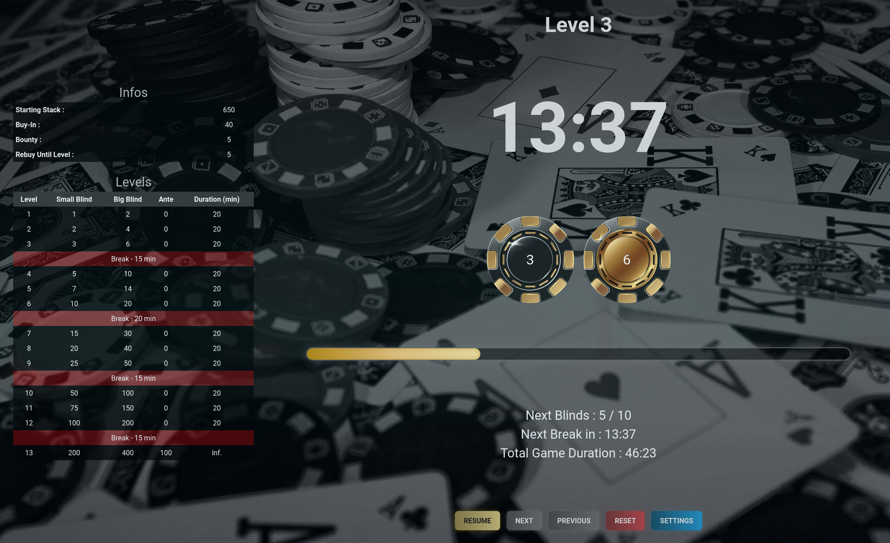
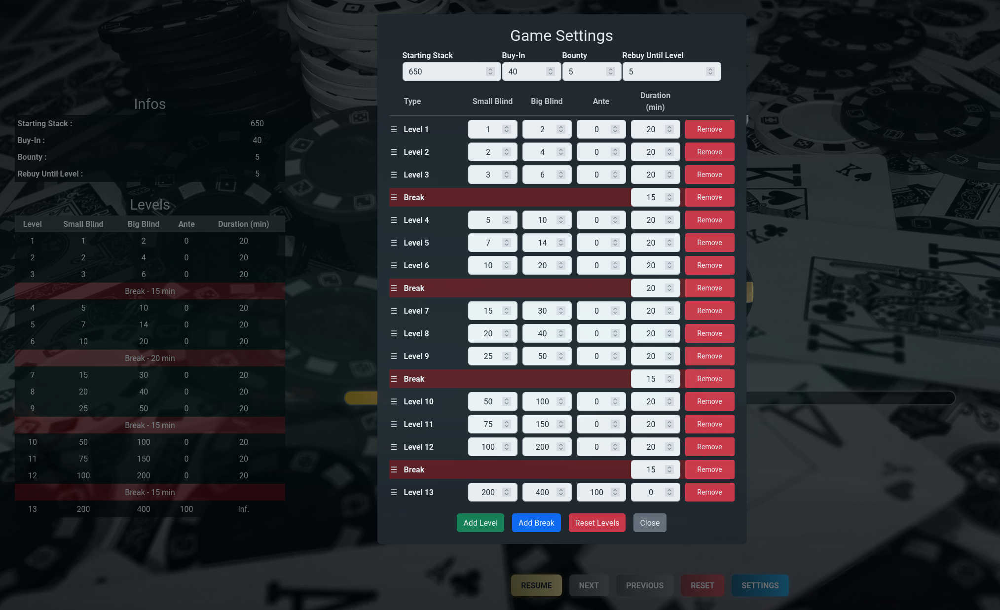

<p align="center">
  <a href="https://timer.poker/"></a>
</p>

<p align="center">
  <a href="https://github.com/k44sh/poker"></a>
</p>

---

## Poker Timer

**Poker Timer** is a web application designed to manage your poker games effortlessly. Track levels, blinds, antes, and game durations in a user-friendly interface. Fully customizable with support for multiple languages.

<p align="center">
  <strong><a href="https://timer.poker/">ONLINE VERSION</a></strong>
</p>

## Features

- **Customizable Game Levels**:
  - Define small and big blinds, antes, and durations for each level.
  - Add, edit, or remove levels during gameplay.
  - Include breaks with custom durations between levels.

- **Internationalization (i18n)**:
  - Supports 12 languages (English, French, Spanish, Chinese, Arabic, Russian, and more).
  - Automatic language detection based on the user's browser.

- **Persistent Game State**:
  - Automatically saves your game's progress to `localStorage`.
  - Reload your game state when reopening the browser.

- **Audio Notifications**:
  - Alerts for level transitions and breaks.

- **Timer Controls**:
  - Start, pause/resume, skip to next/previous level, or reset the game.

## Multi-Language Support

Poker Timer supports the following languages:

- English
- French
- Spanish
- Chinese
- Arabic
- Russian
- Portuguese
- Hindi
- Italian
- Dutch
- Japanese
- German

You can add custom translations by editing or adding `.json` files in the `lang/` directory.

## How to Customize

Poker Timer ensures a seamless user experience by saving your game settings and progress automatically in the browser.

This functionality is powered by the browser's `localStorage`, allowing you to resume your game or keep your customized configurations intact even after closing or refreshing the page.

<p align="center">
  <a href="https://gitlab.com/cyberpnkz/poker"></a>
</p>

#### How It Works

1. **Default Configuration**:
   - The application loads its initial settings from the `config.json` file when it is first opened.

2. **Changes Made in the App**:
   - Any changes made via the **Settings** (e.g., editing levels, adjusting blinds, adding breaks) are immediately saved in the browser's `localStorage`.
   - These settings and game states (current level, timer progress, etc.) will override the defaults from `config.json` for the duration of the session or upon reopening the application.

3. **Persistent State**:
   - If you reload the page or reopen the browser, Poker Timer will:
     - Load your saved levels, breaks, and game configurations from `localStorage`.
     - Restore the game timer to its last state, including the current level and remaining time.
   - This ensures that you can pick up exactly where you left off without losing any progress.

4. **Original Configuration**:
   - The `config.json` file remains unchanged. If you want to reset the game to the default settings, you can use the "Reset Levels" button in the **Settings** or clear the browser's `localStorage`.

### Default Configuration (`config.json`)

The application uses a default configuration file (`config.json`) to define the initial game settings.

This file can be modified to adjust the starting stack, buy-in amount, bounty, rebuy levels, and the default levels for your poker game.

Below is an example of the default `config.json`:

```json
{
 	"levels": [
 	 	{ "smallBlind": 1, "bigBlind": 2, "ante": 0, "duration": 1200 },
 	 	{ "smallBlind": 2, "bigBlind": 4, "ante": 0, "duration": 1200 },
 	 	{ "smallBlind": 3, "bigBlind": 6, "ante": 0, "duration": 1200 },
 	 	{ "duration": 900, "isBreak": true },
 	 	{ "smallBlind": 5, "bigBlind": 10, "ante": 0, "duration": 1200 },
 	 	{ "smallBlind": 7, "bigBlind": 14, "ante": 0, "duration": 1200 },
 	 	{ "smallBlind": 10, "bigBlind": 20, "ante": 0, "duration": 1200 },
 	 	{ "duration": 1200, "isBreak": true },
 	 	{ "smallBlind": 15, "bigBlind": 30, "ante": 0, "duration": 1200 },
 	 	{ "smallBlind": 20, "bigBlind": 40, "ante": 0, "duration": 1200 },
 	 	{ "smallBlind": 25, "bigBlind": 50, "ante": 0, "duration": 1200 },
 	 	{ "duration": 900, "isBreak": true },
 	 	{ "smallBlind": 50, "bigBlind": 100, "ante": 0, "duration": 1200 },
 	 	{ "smallBlind": 75, "bigBlind": 150, "ante": 0, "duration": 1200 },
 	 	{ "smallBlind": 100, "bigBlind": 200, "ante": 0, "duration": 1200 },
 	 	{ "duration": 900, "isBreak": true },
 	 	{ "smallBlind": 200, "bigBlind": 400, "ante": 100, "duration": 0 }
 	],
	"stack": 650,
	"buyIn": 40,
	"rebuyUntilLevel": 5,
	"bounty": 5
}
```

## Contributing

Contributions are welcome! Please see the [CONTRIBUTING.md](CONTRIBUTING.md) file for guidelines.
